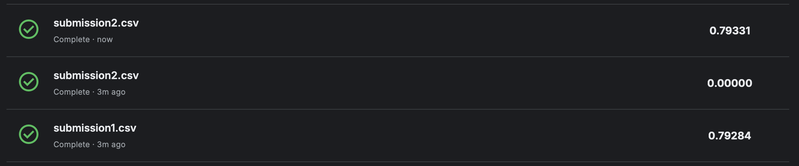

# Spaceship Titanic Classification

## Kaggle Result
XGBoost gave the best performance on the test set. Here is my submission screenshot:

## Conclusions
- We performed EDA and found that passenger expenses are highly skewed, with many zeros and outliers.
- XGBoost outperformed Random Forest on the unseen test data.
- This shows that tree-based ensembles can perform very well with proper tuning.